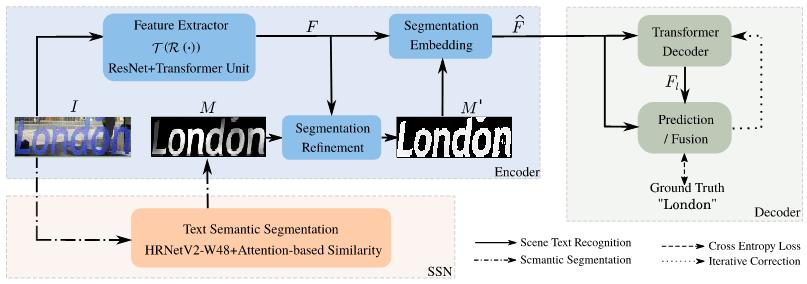
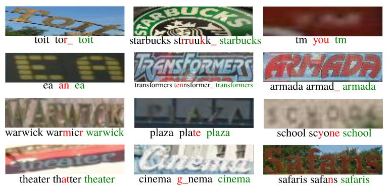

# Background-Insensitive Scene Text Recognition with Text Semantic Segmentation

ECCV 2022




## Acknowledgements

The code is based on the https://arxiv.org/pdf/2103.06495.pdf, we sincerely thank Fang et al. for the awesome repo. 


## Runtime Environment

pip install -r requirements.txt


## Datasets

- Training datasets

    1. [MJSynth](http://www.robots.ox.ac.uk/~vgg/data/text/) (MJ): 
        - Use `tools/create_lmdb_dataset.py` to convert images into LMDB dataset
        - [LMDB dataset BaiduNetdisk(passwd:n23k)](https://pan.baidu.com/s/1mgnTiyoR8f6Cm655rFI4HQ)
    2. [SynthText](http://www.robots.ox.ac.uk/~vgg/data/scenetext/) (ST):
        - Use `tools/crop_by_word_bb.py` to crop images from original [SynthText](http://www.robots.ox.ac.uk/~vgg/data/scenetext/) dataset, and convert images into LMDB dataset by `tools/create_lmdb_dataset.py`
        - [LMDB dataset BaiduNetdisk(passwd:n23k)](https://pan.baidu.com/s/1mgnTiyoR8f6Cm655rFI4HQ)
    3. [Real data] (Real'): Please refer to https://github.com/ku21fan/STR-Fewer-Labels/blob/main/data.md.
        

- Evaluation datasets, LMDB datasets can be downloaded from [BaiduNetdisk(passwd:1dbv)](https://pan.baidu.com/s/1RUg3Akwp7n8kZYJ55rU5LQ), [GoogleDrive](https://drive.google.com/file/d/1dTI0ipu14Q1uuK4s4z32DqbqF3dJPdkk/view?usp=sharing).
    1. ICDAR 2013 (IC13)
    2. ICDAR 2015 (IC15)
    3. IIIT5K Words (IIIT)
    4. Street View Text (SVT)
    5. Street View Text-Perspective (SVTP)
    6. CUTE80 (CUTE)

## Pretrained Models

Get the pretrained models from [BaiduNetdisk(passwd:kwck)](https://pan.baidu.com/s/1b3vyvPwvh_75FkPlp87czQ), [GoogleDrive](https://drive.google.com/file/d/1mYM_26qHUom_5NU7iutHneB_KHlLjL5y/view?usp=sharing). 

## Training

```
CUDA_VISIBLE_DEVICES=0 python main.py --config=configs/train.yaml
```

## Evaluation

```
CUDA_VISIBLE_DEVICES=0 python main.py --config=configs/train.yaml --phase test --image_only
```
Additional flags:
- `--checkpoint /path/to/checkpoint` set the path of evaluation model 
- `--test_root /path/to/dataset` set the path of evaluation dataset
- `--model_eval [alignment|vision]` which sub-model to evaluate
- `--image_only` disable dumping visualization of attention masks


## Visualization
Comparison of attention-based methods with ours on complex background images.


## Citation
If you find our method useful for your reserach, please cite
```bash 
@article
 ```


